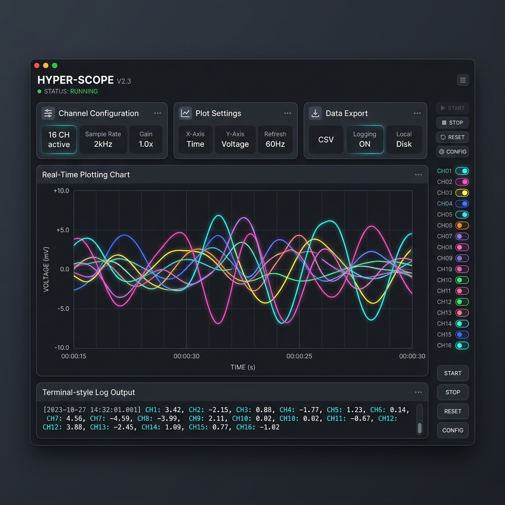

# JHJ_PySerial-GUI

16채널 시리얼 데이터를 실시간으로 모니터링하고 로그로 기록하는 고성능 GUI 애플리케이션입니다.  
기존 Tkinter/Matplotlib 기반의 로거 프로그램을 **PySide6(Qt6)**와 **PyQtGraph** 스택으로 전면 마이그레이션하여, 시스템 메모리 사용량을 최소화하고 16채널 고속 데이터 수신 시에도 CPU 부하가 걸리지 않도록 최적화했습니다.



---

## 🌟 주요 특징

1. **고성능 16채널 렌더링**: PyQtGraph의 OpenGL 가속 드로잉 기술을 활용하여, 115200bps 이상의 고속 전송 환경에서도 화면이 끊기지 않고 16채널 신호를 부드럽게 실시간 플로팅합니다.
2. **QThread 기반의 스레드 안전성**: 시리얼 통신 수신 루프를 백그라운드 스레드로 격리하고, Qt의 Signal-Slot 메커니즘을 적용하여 UI 얼어붙음(Freezing)이나 오동작 크래시를 원천 차단했습니다.
3. **메모리 누수(Leak) 차단**: 
   * 메모리에 데이터를 무한정 쌓아두는 대신, 수신 즉시 로컬 디스크 파일에 직접 쓰는 스트리밍 로깅을 설계했습니다.
   * 그래프 큐 크기와 로그 모니터 창의 행 수를 최대 1,000개로 한정 관리하여, 수십 시간 연속 구동 시에도 메모리 점유율을 수십 MB 수준으로 고정시켰습니다.
4. **자동 재연결 및 반응형 포트 감지**: 
   * 장치가 강제로 끊겼을 때도 시스템이 안전하게 대기하다가 장치가 다시 연결되면 실시간 재연결을 시도합니다.
   * 포트 선택 상자를 클릭할 때마다 실시간으로 사용 가능한 COM 포트 목록을 갱신합니다.
5. **다크 플랫 테마**: Charcoal & Dark 디자인의 QSS 테마와 가독성이 우수한 16채널 전용 네온 컬러 테이블을 적용했습니다.
6. **시스템 트레이 백그라운드 모드**: 창의 닫기 버튼을 누를 때 트레이 아이콘으로 최소화되어 백그라운드에서 끊김 없이 수신 및 로깅을 지속합니다. (설정에서 기능 온/오프 가능)

---

## 🔧 설치 및 실행 방법

### 1. 요구사항
* Python 3.10 이상

### 2. 라이브러리 설치
프로젝트 루트 디렉토리에서 아래 명령어를 실행하여 필수 의존성 패키지를 설치합니다.
```bash
pip install -r requirements.txt
```

### 3. 프로그램 실행
```bash
python JHJ_PySerial-GUI.py
```

---

## 📝 상세 사용 방법

1. **장치 연결 (Serial Port Config)**
   * `Port` 드롭다운 목록을 누르면 실시간으로 연결된 시리얼 장치(COM) 목록이 표시됩니다.
   * 원하는 포트와 통신 속도(`Baud Rate`)를 지정하고 **Connect** 버튼을 누릅니다.
   * 수신 상태가 정상적이면 하단 그래프와 모니터 창에 실시간 데이터가 출력됩니다. 연결 해제 시에는 **Disconnect** 버튼을 누릅니다.
2. **주기적 자동 저장 (Auto Save Config)**
   * 기본 저장 간격은 10분입니다. 값을 수정한 후 **Set Interval** 버튼을 누르면 주기를 변경할 수 있습니다.
   * 지정된 주기마다 파일 이름 뒤에 생성 시각이 포함된 새 CSV 파일(예: `Auto_Save/data_2026-07-01 20-30-00.csv`)로 자동 분할되어 저장됩니다.
   * 모든 전체 기록 데이터는 `Data/data.csv` 파일에 실시간으로 끊김 없이 누적 기록됩니다.
3. **수동 파일 저장 (Manual Save Config)**
   * **Manual Save** 버튼을 클릭하면, 현재 백그라운드에서 상시 기록 중이던 세션 데이터의 복사본을 사용자가 지정한 이름과 경로의 CSV 파일로 즉시 저장할 수 있습니다.
4. **트레이 최소화 설정**
   * **Minimize to Tray on Close** 체크박스를 체크한 상태에서 닫기(`X`) 버튼을 누르면 트레이 아이콘으로 축소되어 백그라운드 작동이 유지됩니다. 
   * 트레이 아이콘을 우클릭하여 **Exit**을 누르면 완전 종료됩니다.
5. **화면 초기화**
   * **Clear Monitor**: 수신 텍스트 화면을 비웁니다.
   * **Clear Graph**: 그래프를 비우고 데이터를 초기화합니다.

---

## ✉️ 문의 사항 및 개발/임베디드 외주 안내

임베디드 하드웨어 설계, 펌웨어(S/W) 개발 및 통신 모니터링/제어용 GUI 프로그램 맞춤 제작에 대한 개발 외주 의뢰를 환영합니다.

### 🛠️ 주요 협업 가능 분야
* **임베디드 시스템 설계**: MCU(Cortex-M, AVR, PIC 등) 및 하드웨어 회로 설계, 펌웨어 개발
* **통신 프로토콜 구현**: RS232/485, Modbus, TCP/IP, CAN, SPI/I2C 유선/무선 통신 제어
* **GUI 솔루션 개발**: 실시간 계측 데이터 다채널 모니터링 대시보드 및 로깅 툴킷 제작 (PySide6, PyQtGraph)
* **공정 제어 및 계측**: 센서 측정값 분석, 모터 컨트롤, 액추에이터 제어 자동화 시스템 구축

### 📬 연락처 및 문의처
* **프로젝트 의뢰/기술 문의**: [이곳에 이메일 또는 연락처를 기재해 주세요]
* **버그 제보 및 건의 사항**: GitHub [Issues](https://github.com/Janghanju/JHJ_PySerial-GUI/issues)에 남겨주시면 신속하게 조치해 드리겠습니다.
